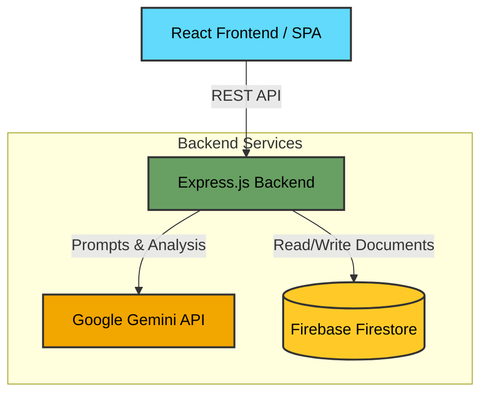
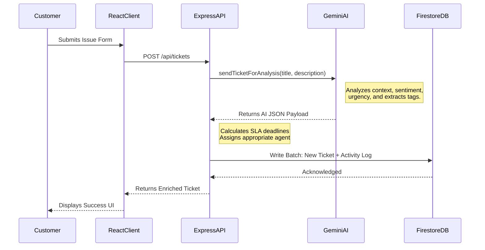
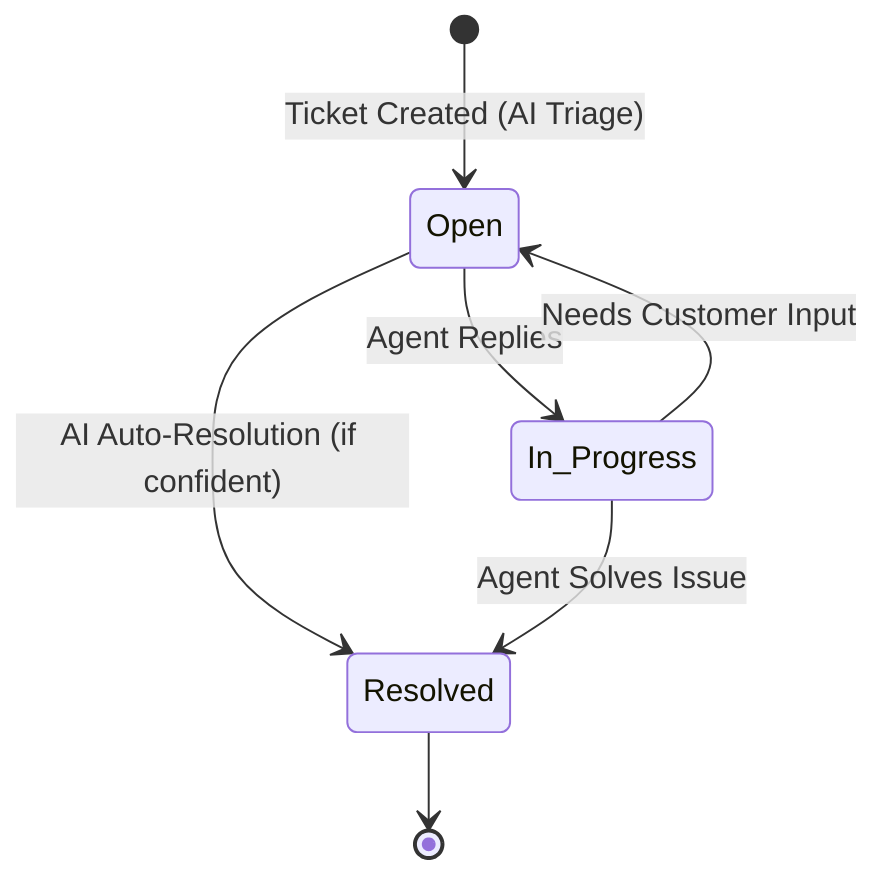

# Intelligent Customer Support & Ticketing Engine

An advanced, full-stack ticketing system that leverages AI to automate customer support triage. It uses the Gemini API to analyze incoming support requests, classify them, detect sentiment, assign priority, calculate SLAs, and generate draft responses, while using Firebase Firestore for durable data persistence.

## 🚀 Core Features

1. **AI-Powered Triage**: Automatically categorizes incoming tickets, determines urgency/priority, and assesses customer sentiment using Gemini.
2. **Automated SLA Tracking**: Calculates response and resolution Service Level Agreements (SLAs) based on the AI-determined urgency.
3. **Smart Replies**: Generates context-aware draft responses based on the ticket content and inferred intent.
4. **Real-time Analytics Dashboard**: Tracks system metrics, SLA compliance rates, sentiment breakdowns, and agent workloads.
5. **Durable Persistence**: All tickets, activity logs, and quick replies are safely stored in Firebase Firestore.

---

## 🏗️ Architecture Overview

The application is built using a modern full-stack JavaScript architecture.

### Technology Stack
* **Frontend**: React 18, Vite, Tailwind CSS (for styling), Lucide React (for iconography), Recharts (for data visualization).
* **Backend**: Node.js, Express.js.
* **Database**: Firebase Firestore (NoSQL Document Database).
* **AI Engine**: Google Gemini API via `@google/genai` SDK.

---

## 🔄 System Workflows

### 1. Ticket Ingestion & AI Processing Pipeline

When a customer submits a new ticket, the system doesn't just save it to a database. It intercepts the request and enriches it with AI metadata before persistence.

### 2. Agent Resolution Flow

---

## 📂 Project Structure & Explanation

The codebase is split into two primary domains: Client (`src/`) and Server (`server/`).

### Server (Backend)
Located in the `/server` directory. It is bundled via `esbuild` for production into a single CommonJS file (`dist/server.cjs`).

*   **`server.ts`**: The main Express application entry point. It sets up REST API endpoints (`/api/tickets`, `/api/metrics`, etc.) and mounts the Vite middleware to serve the React frontend in development.
*   **`geminiService.ts`**: Contains the logic that connects to the Gemini API. It defines the strict JSON schema required for the AI output, ensuring the AI categorizes the ticket reliably (Urgency: low/medium/high/urgent, Sentiment: positive/neutral/negative/frustrated/urgent).
*   **`firebase.ts`**: Initializes the Firebase SDK connection. It dynamically loads credentials from a configuration file and exports the `db` (Firestore) instance.
*   **`ticketStore.ts`**: The core data access layer. It handles all CRUD operations for tickets. When a ticket is created, it calls `analyzeTicketWithAI()` to merge AI intelligence with standard ticket data before writing to Firestore.

### Source (Frontend)
Located in the `/src` directory.

*   **`main.tsx` & `App.tsx`**: The entry points for the React application. Handles global routing, layout, and state.
*   **`components/`**: Modular UI elements built with Tailwind CSS.
*   **`types.ts`**: Centralized TypeScript definitions representing the shape of Tickets, AI Analysis objects, and Metrics. Sharing types between backend and frontend ensures end-to-end type safety.

---

## 🧠 Why These Architectural Decisions Were Made

1.  **Why Gemini for Support?** 
    Traditional support relies on rules engines (e.g., "if title contains 'billing', assign to finance"). Gemini parses semantic meaning, understanding that "I was charged twice" implies billing, high urgency, and frustrated sentiment without explicit keywords.
2.  **Why Firebase Firestore?** 
    Customer support data is highly document-centric. Firestore's NoSQL model perfectly fits the nested structure of a ticket (which includes arrays of messages, AI analysis objects, and arrays of tags). It scales effortlessly and provides durable cloud storage.
3.  **Why Express over Next.js/Remix?** 
    A custom Express backend provides fine-grained control over the AI request pipeline. It ensures that API keys (`GEMINI_API_KEY`) remain strictly on the server and are never exposed to the client bundle.
4.  **Why Single View Application (SPA)?**
    Dashboard environments require instantaneous state transitions without full page reloads. Using React with Vite provides maximum responsiveness for agents dealing with live support queues.

---

## ⚙️ Environment Variables & Configuration

To run this project, the following environment setups are required:

-   `GEMINI_API_KEY`: The API key used by the backend to authenticate with Google's generative AI models.
-   `firebase-applet-config.json`: The Firebase credentials file used by the backend to write to Firestore securely.

The application uses standard `npm run build` and `npm run start` commands for production deployment. In development mode (`npm run dev`), the Express server orchestrates the Vite frontend via middleware for a unified port `3000` experience.
